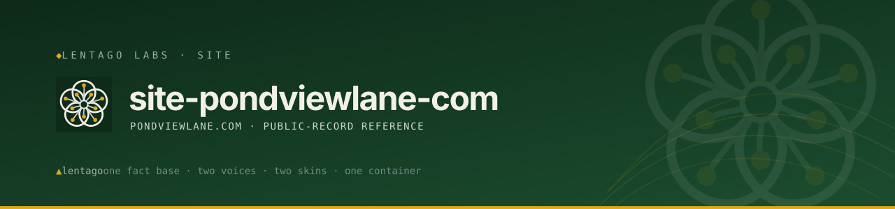

<!-- Lentago Labs brand header — generated by lentago/.github → brand/generate.py.
     Regenerate there; do not hand-edit the banner or badge URLs. -->
<a href="https://lentago.dev"></a>

[](https://github.com/lentago/site-pondviewlane-com/actions) [](https://github.com/lentago/site-pondviewlane-com/blob/main/LICENSE) [](https://deepwiki.com/lentago/site-pondviewlane-com)

  

# site-pondviewlane-com — Pond View Lane public-record site

The site content for **[pondviewlane.com](https://pondviewlane.com)** — a
plain-English, **public-record-only** reference for residents of Pond View Lane
(the Essex Crossing at Montserrat subdivision) in Beverly, Massachusetts. It
collects the recorded instruments, city filings, and public timeline that define
the neighborhood and its homeowners association, with an "Ask" box that answers
questions from those records — so a resident doesn't have to drive to the
registry of deeds to understand what they own and what the rules are.

It's an [Astro](https://astro.build) / [Starlight](https://starlight.astro.build)
static site served as a container on the
[solidago](https://github.com/lentago/solidago) AWS stack (GitHub OIDC → ECR →
ECS Fargate → ALB), the same platform that runs
[lentago.dev](https://lentago.dev) and
[icecreamtofightwith.com](https://icecreamtofightwith.com).

**Two domains, one fact base.** The same records are also published under the
subdivision's legal name, **essexcrossingatmontserrat.com** — a second front door
for buyers, attorneys, and title searchers, with its own visual skin *and its own
voice* (see `essex-crossing-voice-guide.md`). The two skins share facts, not
words: prose lives in `content/base/` with per-page Essex-voice overrides in
`content/essex/`, composed into the build per skin, and a facts-parity check
guarantees every figure, date, and citation in the base appears in the Essex
variant. A build-time `SITE` switch selects the presentation shell (site URL,
title, brand assets, stylesheet); CI builds both variants into one nginx
container that serves each by `Host` header. This single-fact-source design is a
deliberate exception to the fleet's one-repo-per-domain convention — it's the
guard against two sites of record drifting apart.

> **Not official, not legal advice.** This is a resident's reference, **not** a
> publication of the homeowners association, and nothing here is legal advice.
> The site names no residents; board history is told through the recorded
> instruments themselves.

**Authorship:** This repo is co-written with [Claude](https://claude.ai)
(Anthropic). A Pond View Lane resident directs the work, supplies the records and
the guide copy, and reviews the output; Claude writes the code and the tooling.
The maintainer is an infrastructure operator, not a software engineer — please
don't read this repo as a portfolio of one.

## Public-record-only, and self-contained

Everything here traces to a **public record** (Southern Essex Registry of Deeds,
City of Beverly filings/minutes, the assessor, MassDEP). This repo is **fully
self-contained**: it holds its own source — the recorded documents and their
metadata (`library/`), the public timeline (`timeline/events.json`), and the
site imagery (`attachments/`) — and a build-time generator turns that source
into the site's pages. There is no external dependency and no internal
association material: meeting minutes, budgets, insurance, vendor invoices, and
correspondence are **not** public records and are simply not here.

**And it's checkable.** Every library document carries a **"Verify at source"**
link to the portal it can be pulled from independently — the Registry
([salemdeeds.com](https://salemdeeds.com/)), the City assessor
([Patriot Properties](https://beverly.patriotproperties.com/)), the
[Beverly Agenda Center](https://www.beverlyma.gov/AgendaCenter),
[MassGIS](https://massgis.maps.arcgis.com/apps/OnePane/basicviewer/index.html?appid=47689963e7bb4007961676ad9fc56ae9),
or [EEA ePLACE](https://eplace.eea.mass.gov/EEAPublicApp) — and every map on
the site names the public viewer it was captured from and links to it, so a
reader can reproduce the view rather than take the site's word for it.

A content-hygiene check (`scripts/check-content.mjs`) guards the invariant — no
resident names outside the recorded documents, every library document marked as
a public record, every image on an explicit allowlist.

## What's here

| Path | Purpose |
|---|---|
| `content/base/` | The hand-written prose — homepage, About, and the eight resident guides (start here, governance, common land, stormwater, wetlands, assessments, records, trees). |
| `content/essex/` | Per-page Essex-voice overrides (The Obsequious Document), composed over the base for the essexcrossing skin. |
| `library/` | **Source of record:** `manifest.json` (document metadata, including the `verify` portal link rendered as each page's "Verify at source" row) + `files/` (the recorded instruments / city filings) + `text/` (searchable text extracts). |
| `timeline/events.json` | **Source:** the public-records chronology, one entry per dated event. |
| `attachments/` | **Source:** the maps, plans, and diagrams the guides embed (the allowlist the generator publishes). |
| `scripts/sync-content.mjs` | The build-time generator: turns `library/` + `timeline/` + `attachments/` into the site's content collections + the Ask index. |
| `scripts/check-content.mjs` | The content-hygiene check (public-record-only invariant). |
| `src/components/` · `src/pages/` · `src/styles/` | The Ask widget/dock, the report-an-issue form, the footer, and the site styling — `custom.css` (shared base) + `essex.css` (the Essex Crossing estate skin, layered on top). |
| `astro.config.mjs` | The `SITE` switch (`pondview` \| `essexcrossing`) that selects each domain's presentation shell; everything else (sidebar, content, sitemap filter) is shared. |
| `functions/ask/handler.mjs` | The "Ask" answer Lambda (reference copy; vendored to solidago `modules/ask-lambda`). Multi-origin CORS — both domains share the one Lambda. |
| `Dockerfile` / `nginx.conf` / `nginx-common.conf` | Packages both builds (`dist-pondview` + `dist-essexcrossing`) into one `nginx` container on port `8080`, Host-switched, with a `/health` endpoint for the ALB. |
| `.github/workflows/deploy.yml` · `ci.yml` | Build → ECR → ECS rollout via OIDC on push to `main`; the PR `Build` gate. |

## How it's built & served

```bash
npm install
npm run build      # sync → both skins (dist-pondview/ + dist-essexcrossing/) → hygiene check
npm run check      # re-run the public-record / anonymity sweep over every dist*/ on its own
npm run preview    # local preview (SITE=essexcrossing npm run dev to preview the Essex skin)
```

`npm run build` builds **both** domain skins and then runs
`scripts/check-content.mjs` over both outputs (npm's `postbuild` hook), so CI's
required `Build` check and the deploy both build-and-verify the two variants
without any workflow-specific wiring.

The `sync` step (hooked before `dev`/`build`) regenerates the document pages,
the timeline, and the Ask index from `library/` + `timeline/` + `attachments/`,
so the generated output isn't committed — the source is. 

Docker copies both `dist-pondview/` and `dist-essexcrossing/` into `nginx`
(`:8080`, `/health` on the default vhost), which serves each by request `Host`
header; GitHub Actions builds the image, pushes it to ECR, and rolls the ECS
service via the solidago platform OIDC role — no long-lived credentials. The ECR
repo, ECS service, the Ask Lambda (`module.ask_pondview`), and the OIDC trust for
this repo are provisioned in `solidago` (`modules/site` + `modules/ask-lambda`);
the second domain's DNS/TLS/ALB host rule and the Ask CORS value land there too
(`lentago/solidago#137`).

## Status

The site currently serves as a **hidden, unlisted preview** for association
trustees to review; it carries `robots noindex` and is not yet at its public
`pondviewlane.com` domain. The public launch (real domain + removing `noindex`)
is a deliberate, separate step.

---

*Part of the [Lentago Labs](https://github.com/lentago) portfolio.*
